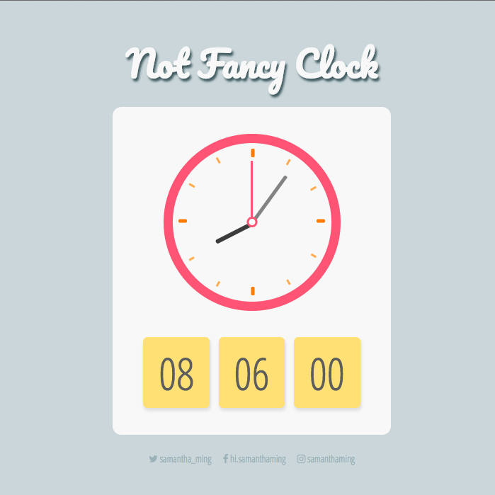

# Not Fancy Clock

A simple, not fancy at all, digital and analog clock.

**Features include:**
- Display the hours, minutes, and seconds in real time
- Move the clock hands around its face in real time

**Built using:**
- Vue
- Google Fonts - Pacifico, Open Sans Condensed

<br>

Play around with it on [CodePen](https://codepen.io/samanthaming/pen/jKoLpq)  
Or see it live! [here](https://samanthaming.github.io/not-fancy-clock/)

<br>



# Notes

Here are the general steps to create your own Not Fancy Clock.

## 1. Making your clock move

The tricky part of this challenge is that you have to use `setInterval` to create the `new Date()` object. So it is continuously updating your time, making your clock move in real time.

```javascript
methods: {
  
  // Populate the data with the new Date information
  clock() {
    let now = new Date();
    this.hour = now.getHours();
    this.min = now.getMinutes();
    this.sec = now.getSeconds();
    
    // The degree data is to move the hands in our analog clock
    this.secDeg = ((this.sec / 60) * 360) + 90;
    this.minDeg = ((this.min / 60) * 360) + ((this.sec / 60) * 6) + 90;
    this.hourDeg = ((this.hour / 12) * 360) + ((this.min / 60) * 30) + 90;
  },
  
  // We need to continuously update our data 
  //  so the clock moves in real time
  updateClock() {
    setInterval(() => this.clock(), 1000);
  }
}
```

## 2: Moving the clock hands

To move the clock hands, we're going to use CSS's rotate function available in the transform property.

We can use Vue's inline style to change the rotate degree:

```html
<div
  v-bind:style="{transform: `rotate(${secDeg}deg)`}"
  class="hand sec-hand"
></div>
```

We use the `clock()` method to update the `sec` and `secDeg` data in our vue file.

```javascript
data: {
  sec: '',
  secDeg: 0,
},
methods: {
  clock() {
    let now = new Date();
    this.sec = now.getSeconds();
    this.secDeg = ((this.sec / 60) * 360);
  }
}
```

## 3: Add a leading `0` to our time

By default, there is no leading `0` for our time.

```javascript
// Example
const now = new Date();
now.getSeconds(); // return 6
```

So we need to create a function to add a leading `0`.

```javascript
function zeroPadded(num) {
  if (num < 10) {
    return `0${num}`;
  }
  return num;
}

zeroPadded(6); // return '06'
```

And we apply this to our hour, min, and sec data.

```javascript
methods: {
  clock() {
    let now = new Date();
    this.hour = zeroPadded(now.getHours());
    this.min = zeroPadded(now.getMinutes());
    this.sec = zeroPadded(now.getSeconds());
  }
}
```

# Resources

- [Code Pen - Digital Clock](https://codepen.io/gau/pen/LjQwGp)
- [CodePen - Analog Clock](https://codepen.io/Paolo-Duzioni/pen/XeXdbm)
- This project was inspired by WesBos' [Javascript30](https://javascript30.com/) - JS and CSS Clock.
